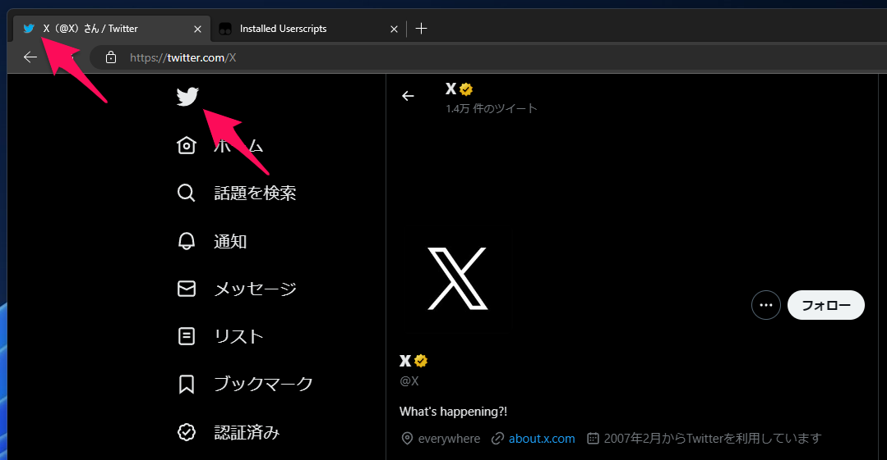
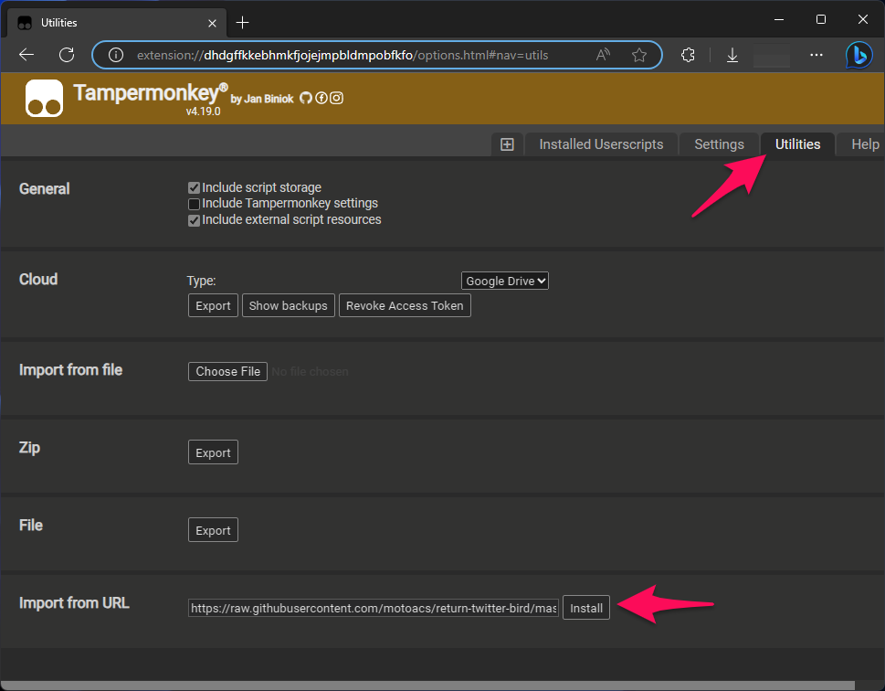

# return-twitter-bird

Twitterの新しいロゴ "X" を従来の鳥に置き換えるだけのユーザースクリプトです。サイト側の仕様がコロコロ変わるので、動かないかもしれません。

This is a UserScript that replaces Twitter's new logo "X" with a previous bird.

## Install

Tampermonkey等のユーザースクリプト実行環境に、以下のURLを指定してインストールできます。セキュリティー的に心配なら、ご自身のGitHubアカウントにForkしてからインストールすると良いと思います。

You can install this in a UserScript execution environment such as Tampermonkey by entering the following URL.

```
https://raw.githubusercontent.com/motoacs/return-twitter-bird/master/return-twitter-bird.user.js
```


