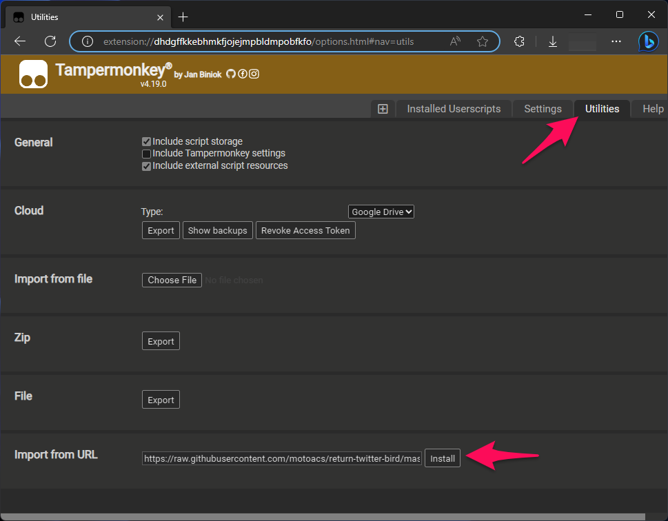

# return-twitter-bird

Twitterの新しいロゴ "X" を従来の鳥に置き換えるだけのユーザースクリプト。自分用に取り急ぎ作ったもので、ちゃんと動くか分かりません。

This is a user script that replaces Twitter's new logo "X" with a traditional bird

## Install

Tampermonkey等のユーザースクリプト実行環境に、以下のURLを指定してインストールできます

You can be installed in a user script execution environment such as Tampermonkey by specifying the following URL

```
https://raw.githubusercontent.com/motoacs/return-twitter-bird/master/return-twitter-bird.user.js
```


